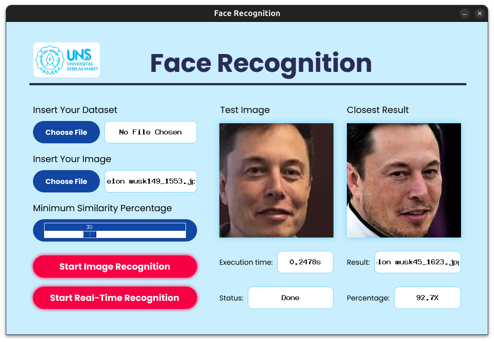

# *Face Recognition* dengan Eigenface





## Daftar Isi
* [Deskripsi](#deskripsi)
* [Dependensi yang Digunakan](#dependensi-yang-digunakan)
* [Fitur Utama](#fitur-utama)
* [Setup](#setup)
* [Penggunaan](#penggunaan)
* [Referensi](#referensi)
* [Anggota Kelompok](#anggota-kelompok)

## Deskripsi
- Pengenalan wajah (*Face Recognition*) adalah teknologi biometrik yang bisa dipakai untuk mengidentifikasi wajah seseorang untuk berbagai kepentingan khususnya keamanan. Program pengenalan wajah melibatkan kumpulan citra wajah yang sudah disimpan pada database lalu berdasarkan kumpulan citra wajah tersebut, program dapat mempelajari bentuk wajah lalu mencocokkan antara kumpulan citra wajah yang sudah dipelajari dengan citra yang akan diidentifikasi.
- Sekumpulan citra wajah akan digunakan dengan representasi matriks. Dari representasi matriks tersebut akan dihitung sebuah matriks Eigenface. Program pengenalan wajah dapat dibagi menjadi 2 tahap berbeda yaitu tahap training dan pencocokkan. Pada tahap training, akan diberikan kumpulan data set berupa citra wajah. Citra wajah tersebut akan dinormalisasi dari RGB ke Grayscale (matriks), hasil normalisasi akan digunakan dalam perhitungan eigenface.
- Pada tahapan akhir, akan ditemui gambar dengan euclidean distance paling kecil maka gambar tersebut yang dikenali oleh program paling menyerupai test face selama nilai kemiripan di bawah suatu nilai batas. Jika nilai minimum di atas nilai batas maka dapat dikatakan tidak terdapat citra wajah yang mirip dengan test face
<!-- You don't have to answer all the questions - just the ones relevant to your project. -->


## Dependensi yang Digunakan
- python - versi 3.10
- numpy - versi 2.2.6
- opencv-python - versi 4.11.0.86
- Pillow - versi 11.2.1

Catatan: dapat juga menggunakan versi dependensi yang lain selama tidak ada konflik antardependensi dan versi dependensi tersebut dapat digunakan untuk menjalankan program face_recognition_app.py yang ada pada repositori ini.


## Fitur Utama
- *Face recognition* berdasarkan gambar yang dipilih
- *Face recognition* secara realtime dengan kamera
- Status proses *face recognition*
- Persentase kemiripan dari hasil proses *face recognition*


## Setup
- Install seluruh dependensi yang tercantum pada bagian [Dependensi yang Digunakan](#dependensi-yang-digunakan).

- Setelah Python terinstall, dependensi lain dapat diinstall secara manual atau dapat juga diinstall menggunakan pip dan file `requirements.txt` yang tersedia

    `pip install -r requirements.txt`


## Penggunaan
1. Masuk ke direktori src dan jalankan program `face_recognition_app.py`

    `python3 face_recognition_app.py`

2. Pilih dataset yang akan digunakan. Dataset sudah di sediakan di direktori `test/dataset`, namun dapat juga menggunakan dataset lain yang dimiliki. Struktur dataset yang digunakan yaitu sebagai berikut
    ```
    dataset
        ├── gambar1
        ├── gambar2
        ├── gambar2
        ├── ...
        └── gambarN
    ```

3. Pilih dan gunakan metode *face recognition* yang diiginkan
    - Menggunakan gambar uji

        Pilih gambar yang ingin diuji menggunakan *face recognition*, lalu tekan tombol 'Start Image Recognition'. Gambar uji sudah disedian di direktori `test/data_uji`, namun dapat juga menggunakan gambar lain yang dimiliki. Gambar yang tersedia di direktori `test/data_uji` merupakan gambar yang tidak terdapat di direktori `test/dataset`.
    - Menggunakan kamera secara realtime

        Tekan tombol 'Start Real-Time Recognition', lalu tekan tombol 'Stop Real-Time Recognition' saat ingin menghentikan *face recognition* secara *real-time*.    


## Referensi
- [https://docs.python.org/3/library/tkinter.ttk.html](https://docs.python.org/3/library/tkinter.ttk.html)
- [https://hendri.lecturer.pens.ac.id/MyPublication/AkhmadHendriawan_IES-21-okt-2009.pdf](https://hendri.lecturer.pens.ac.id/MyPublication/AkhmadHendriawan_IES-21-okt-2009.pdf)
- [https://informatika.stei.itb.ac.id/~rinaldi.munir/AljabarGeometri/2022-2023/Algeo-19-Nilai-Eigen-dan-Vektor-Eigen-Bagian2-2022.pdf](https://informatika.stei.itb.ac.id/~rinaldi.munir/AljabarGeometri/2022-2023/Algeo-19-Nilai-Eigen-dan-Vektor-Eigen-Bagian2-2022.pdf)
- [https://stackoverflow.com/questions/53263842/how-to-calculate-eigenfaces-in-python](https://stackoverflow.com/questions/53263842/how-to-calculate-eigenfaces-in-python)
- [https://www.sciencedirect.com/topics/computer-science/eigenface](https://www.sciencedirect.com/topics/computer-science/eigenface)


## Anggota Kelompok
- L0124022 - Lutfiyah Istiana
- L0124031 - Shafa Rifkika Nur Fauziah